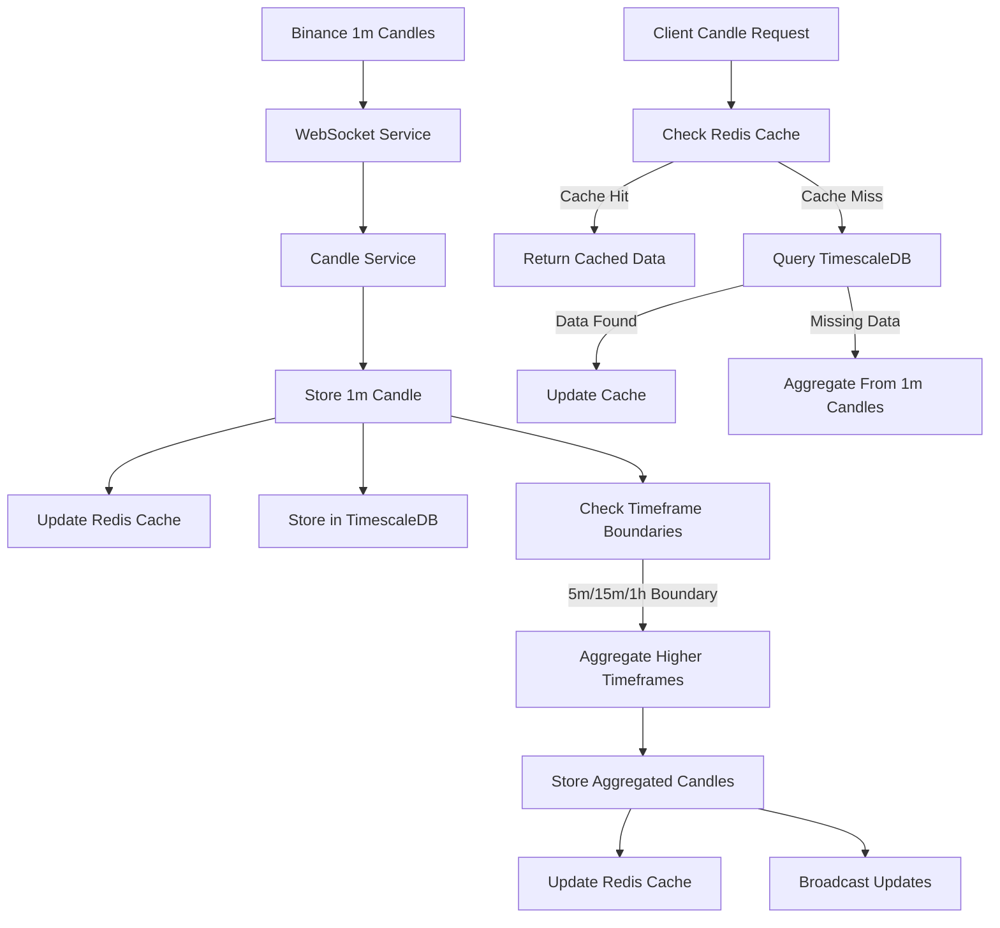

# Candle Data System

## Overview

The Candle Data System is a sophisticated solution for handling OHLCV (Open, High, Low, Close, Volume) data for cryptocurrency trading pairs. It uses a "1-minute first" approach that treats 1-minute candles as the fundamental building blocks for all timeframes, enabling efficient data storage and real-time aggregation across multiple timeframes.

## Core Architecture

### Base Timeframe Approach

Our system is built on a foundational principle: **1-minute candles are the base timeframe from which all other timeframes are derived**. This approach offers several advantages:

1. **Single Source of Truth**: By subscribing only to 1-minute candles from Binance, we reduce the number of WebSocket connections and bandwidth usage.
2. **Automatic Aggregation**: Higher timeframes (5m, 15m, 30m, 1h, 4h, 1d) are dynamically aggregated from 1-minute data.
3. **Consistency**: All timeframes derive from the same source data, ensuring consistency across different chart intervals.
4. **Reduced API Load**: Helps avoid rate limiting on the Binance API by minimizing connection count.

### Components

1. **WebSocket Connection Layer**

   - Subscribes only to 1-minute candles from Binance
   - Handles connection management and reconnection logic
   - Processes incoming data and dispatches to the candle service

2. **Candle Service**

   - Stores 1-minute candles in the database
   - Handles real-time aggregation to higher timeframes
   - Manages data retrieval and caching strategies
   - Implements efficient boundary calculations for timeframe windows

3. **Redis Cache Layer**

   - Caches frequently accessed candle data for fast retrieval
   - Implements timeframe-specific caching strategies
   - Stores latest candles and recently accessed historical data

4. **TimescaleDB Storage Layer**
   - Provides persistent storage for all candle data
   - Optimized for time-series data with hypertables
   - Implements retention policies based on timeframe

### Data Flow



## How Timeframe Aggregation Works

### Real-time Aggregation

When a new 1-minute candle arrives, our system:

1. **Stores** the 1-minute candle in the database
2. **Checks timeframe boundaries** to determine if it should trigger higher timeframe updates
3. **Aggregates** data for all applicable higher timeframes
4. **Broadcasts** the updates to subscribed clients via WebSocket

The key function that handles this is:

```typescript
private async updateHigherTimeframes(symbol: string, candle: OHLCV) {
  // Get current time from the candle
  const candleTime = candle.time;
  const minute = candleTime.getMinutes();
  const hour = candleTime.getHours();

  // Launch parallel updates for all relevant timeframes
  const updates = [];

  // Check 5-minute boundary
  if (minute % 5 === 0) {
    updates.push(this.updateTimeframe(symbol, Timeframe.FIVE_MINUTES, candleTime));
  }

  // Check 15-minute boundary
  if (minute % 15 === 0) {
    updates.push(this.updateTimeframe(symbol, Timeframe.FIFTEEN_MINUTES, candleTime));
  }

  // Check hourly boundary
  if (minute === 0) {
    updates.push(this.updateTimeframe(symbol, Timeframe.ONE_HOUR, candleTime));
  }

  // ...and so on for other timeframes

  // Run all the timeframe updates in parallel
  await Promise.all(updates);
}
```

For each timeframe update, the system:

1. Calculates the exact **timeframe boundary** (e.g., 00:05:00 for a 5-minute candle)
2. Retrieves all 1-minute candles within the timeframe window
3. Aggregates the data (open from first candle, high as max of all highs, etc.)
4. Creates or updates the timeframe candle in the database
5. Broadcasts the update to all clients

### Historical Data Aggregation

For historical data, we employ a multi-step approach:

1. **Try Redis Cache First**: Check if the requested timeframe data is in Redis
2. **Query Native Timeframe**: Look for direct entries in the database
3. **Fallback to Aggregation**: If sufficient data isn't available, aggregate from smaller timeframes
4. **Fill Data Gaps**: Combine database entries with newly aggregated data

This process ensures that even with sparse data, clients receive a complete view of historical price action. The aggregation logic examines time windows and groups candles accordingly:

```typescript
// Group candles by target timeframe
const groupedCandles: Record<string, OHLCV[]> = {};

sourceCandles.forEach((candle) => {
  const time = new Date(candle.time);
  // Round down to the nearest target timeframe
  const targetTime = new Date(
    time.getFullYear(),
    time.getMonth(),
    time.getDate(),
    time.getHours(),
    Math.floor(time.getMinutes() / targetMinutes) * targetMinutes
  );

  const key = targetTime.toISOString();

  if (!groupedCandles[key]) {
    groupedCandles[key] = [];
  }

  groupedCandles[key].push(candle);
});

// Aggregate candles for each time window
const aggregatedCandles = Object.entries(groupedCandles).map(
  ([key, candles]) => {
    const time = new Date(key);
    const open = candles[0].open;
    const close = candles[candles.length - 1].close;
    const high = Math.max(...candles.map((c) => c.high));
    const low = Math.min(...candles.map((c) => c.low));
    const volume = candles.reduce((sum, c) => sum + c.volume, 0);

    return {
      // candle properties
    };
  }
);
```

## API and Client Interaction

### Getting Historical Data

When a client requests historical candle data:

1. The system tries to fetch from appropriate timeframe data directly
2. If insufficient data is found, it automatically aggregates from smaller timeframes
3. Results are merged, sorted, and truncated to the requested limit
4. Data is cached for future requests

```typescript
// First try to get the candles directly from the database
dbCandles = await prisma.oHLCV.findMany({
  where: {
    symbolId: symbolRecord.id,
    timeframe,
    ...(startTime && { time: { gte: startTime } }),
    ...(endTime && { time: { lte: endTime } }),
  },
  // ...other query options
});

// If insufficient data, try to aggregate from smaller timeframe
if (dbCandles.length < limit && timeframe !== Timeframe.ONE_MINUTE) {
  // Get source timeframe and aggregate
  const sourceTimeframe = this.getNextSmallerTimeframe(timeframe);
  const aggregatedCandles = await this.aggregateCandles(
    symbol,
    sourceTimeframe,
    timeframe,
    extendedLimit
  );

  // Combine with existing candles
  // ...
}
```

### WebSocket Subscription

Clients can subscribe to real-time candle updates for any timeframe. The system:

1. Includes the client in the appropriate symbol subscription list
2. Sends historical data for the requested timeframe
3. Delivers real-time updates as new candles form

When handling subscriptions for higher timeframes, the system still only receives 1-minute data from Binance but transforms this data into the appropriate timeframe updates for the client.

## Benefits of Our Approach

1. **Efficiency**: By handling only 1-minute candles from the exchange, we reduce connection overhead and processing complexity.

2. **Resilience**: If higher timeframe data is missing or corrupted, it can always be reconstructed from 1-minute data.

3. **Flexibility**: Supports any timeframe, even custom ones not provided by exchanges.

4. **Consistency**: All timeframes derive from the same source, eliminating discrepancies.

5. **Scalability**: Reduces API connections, making it easier to add more trading pairs.

## Performance Optimizations

1. **Parallel Processing**: Higher timeframe updates run concurrently
2. **Smart Caching**: Timeframe-specific retention policies
3. **Efficient Time Boundary Calculations**: Fast and accurate window calculations
4. **Intelligent Redis Caching**: Only frequently accessed data is cached
5. **Database Indexes**: Optimized for quick timeframe-based queries

## Error Handling and Edge Cases

1. **Missing Data Handling**: Automatically fills gaps by aggregating from smaller timeframes
2. **Time Boundary Edge Cases**: Precise calculations for daylight saving changes
3. **WebSocket Reconnection**: Automatic reconnection with exponential backoff
4. **Duplicate Data**: Handling for potential duplicate candles from exchange

## Features

### 1. Smart Caching Strategy

- **Timeframe-based TTL**:
  ```typescript
  {
    [Timeframe.ONE_MINUTE]: { cacheTTL: 60, maxCachedCandles: 1000 },
    [Timeframe.FIVE_MINUTES]: { cacheTTL: 300, maxCachedCandles: 800 },
    [Timeframe.ONE_HOUR]: { cacheTTL: 3600, maxCachedCandles: 400 },
    [Timeframe.ONE_DAY]: { cacheTTL: 86400, maxCachedCandles: 200 }
  }
  ```

### 2. Data Retention Policies

- **Redis Retention**:

  - 1m candles: 7 days
  - 5m candles: 14 days
  - 15m candles: 30 days
  - 1h candles: 90 days
  - 1d candles: 365 days

- **TimescaleDB Retention**:
  - 1m candles: 30 days
  - 5m candles: 90 days
  - 15m candles: 180 days
  - 1h candles: 730 days
  - 1d candles: 3650 days

### 3. Real-time Updates

- WebSocket notifications for new candles
- Immediate cache updates
- Automatic data aggregation
- Real-time price updates

### 4. Data Aggregation

- Supports multiple timeframes:
  - 1m → 5m
  - 5m → 15m
  - 15m → 1h
  - 1h → 4h
  - 4h → 1d

## API Endpoints

### 1. Get Candles

```typescript
GET /api/candles
Query Parameters:
- symbol: string (required)
- timeframe: Timeframe (default: 1m)
- limit: number (default: 100)
- startTime?: Date
- endTime?: Date
```

### 2. Get Latest Candle

```typescript
GET /api/candles/latest
Query Parameters:
- symbol: string (required)
- timeframe: Timeframe (default: 1m)
```

### 3. Aggregate Candles

```typescript
GET /api/candles/aggregate
Query Parameters:
- symbol: string (required)
- sourceTimeframe: Timeframe (default: 1m)
- targetTimeframe: Timeframe (required)
- limit: number (default: 100)
```

## WebSocket Events

### 1. Candle Update

```typescript
{
  type: "CANDLE_UPDATE",
  data: {
    symbol: string,
    timeframe: Timeframe,
    candle: {
      time: Date,
      open: number,
      high: number,
      low: number,
      close: number,
      volume: number
    }
  }
}
```

## Performance Considerations

### 1. Cache Optimization

- Limited number of cached candles per timeframe
- Automatic cache invalidation
- Smart TTL based on timeframe
- Efficient memory usage

### 2. Database Optimization

- TimescaleDB hypertables
- Efficient indexing
- Automatic data compression
- Smart retention policies

### 3. Query Optimization

- Cache-first approach
- Efficient time-range queries
- Optimized aggregation
- Batch processing

## Error Handling

### 1. Cache Failures

- Graceful fallback to database
- Automatic retry mechanism
- Error logging
- Cache invalidation on errors

### 2. Database Failures

- Connection retry
- Error logging
- Transaction rollback
- Data consistency checks

## Monitoring

### 1. Key Metrics

- Cache hit/miss ratio
- Query response times
- Memory usage
- Database load
- WebSocket connections

### 2. Health Checks

- Redis connection status
- Database connection status
- Cache size monitoring
- Data consistency verification

## Setup and Configuration

### 1. Environment Variables

```env
REDIS_HOST=localhost
REDIS_PORT=6379
REDIS_PASSWORD=
REDIS_DB=0
```

### 2. Dependencies

```json
{
  "dependencies": {
    "ioredis": "^5.3.2",
    "@types/ioredis": "^5.0.0"
  }
}
```

### 3. Database Setup

```sql
-- Enable TimescaleDB extension
CREATE EXTENSION IF NOT EXISTS timescaledb;

-- Create hypertable
SELECT create_hypertable('ohlcv', 'time');

-- Create indexes
CREATE INDEX idx_ohlcv_symbol_timeframe ON ohlcv (symbol_id, timeframe, time DESC);
```

## Best Practices

### 1. Data Management

- Regular data cleanup
- Monitor cache size
- Verify data consistency
- Backup historical data

### 2. Performance

- Use appropriate timeframes
- Monitor query patterns
- Optimize cache size
- Regular maintenance

### 3. Security

- Secure Redis access
- Database authentication
- API rate limiting
- Input validation

## Troubleshooting

### 1. Common Issues

- Cache misses
- Slow queries
- Memory pressure
- Data inconsistency

### 2. Solutions

- Check cache configuration
- Verify database indexes
- Monitor memory usage
- Validate data integrity
