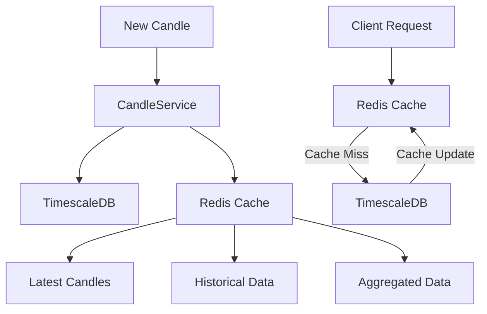

# Candle Data System

## Overview

The Candle Data System is a hybrid solution that combines Redis for caching and TimescaleDB for persistent storage, providing efficient and scalable handling of OHLCV (Open, High, Low, Close, Volume) data for trading pairs.

## Architecture

### Components

1. **Redis Cache Layer**

   - Handles frequently accessed data
   - Provides fast access to recent candles
   - Manages aggregated timeframes
   - Implements smart caching strategies

2. **TimescaleDB Storage Layer**

   - Stores historical candle data
   - Handles data persistence
   - Manages data retention
   - Provides efficient time-series queries

3. **CandleService**
   - Orchestrates data flow between Redis and TimescaleDB
   - Handles real-time updates
   - Manages data aggregation
   - Implements retention policies

### Data Flow



## Features

### 1. Smart Caching Strategy

- **Timeframe-based TTL**:
  ```typescript
  {
    [Timeframe.ONE_MINUTE]: { cacheTTL: 60, maxCachedCandles: 1000 },
    [Timeframe.FIVE_MINUTES]: { cacheTTL: 300, maxCachedCandles: 800 },
    [Timeframe.ONE_HOUR]: { cacheTTL: 3600, maxCachedCandles: 400 },
    [Timeframe.ONE_DAY]: { cacheTTL: 86400, maxCachedCandles: 200 }
  }
  ```

### 2. Data Retention Policies

- **Redis Retention**:

  - 1m candles: 7 days
  - 5m candles: 14 days
  - 15m candles: 30 days
  - 1h candles: 90 days
  - 1d candles: 365 days

- **TimescaleDB Retention**:
  - 1m candles: 30 days
  - 5m candles: 90 days
  - 15m candles: 180 days
  - 1h candles: 730 days
  - 1d candles: 3650 days

### 3. Real-time Updates

- WebSocket notifications for new candles
- Immediate cache updates
- Automatic data aggregation
- Real-time price updates

### 4. Data Aggregation

- Supports multiple timeframes:
  - 1m → 5m
  - 5m → 15m
  - 15m → 1h
  - 1h → 4h
  - 4h → 1d

## API Endpoints

### 1. Get Candles

```typescript
GET /api/candles
Query Parameters:
- symbol: string (required)
- timeframe: Timeframe (default: 1m)
- limit: number (default: 100)
- startTime?: Date
- endTime?: Date
```

### 2. Get Latest Candle

```typescript
GET /api/candles/latest
Query Parameters:
- symbol: string (required)
- timeframe: Timeframe (default: 1m)
```

### 3. Aggregate Candles

```typescript
GET /api/candles/aggregate
Query Parameters:
- symbol: string (required)
- sourceTimeframe: Timeframe (default: 1m)
- targetTimeframe: Timeframe (required)
- limit: number (default: 100)
```

## WebSocket Events

### 1. Candle Update

```typescript
{
  type: "CANDLE_UPDATE",
  data: {
    symbol: string,
    timeframe: Timeframe,
    candle: {
      time: Date,
      open: number,
      high: number,
      low: number,
      close: number,
      volume: number
    }
  }
}
```

## Performance Considerations

### 1. Cache Optimization

- Limited number of cached candles per timeframe
- Automatic cache invalidation
- Smart TTL based on timeframe
- Efficient memory usage

### 2. Database Optimization

- TimescaleDB hypertables
- Efficient indexing
- Automatic data compression
- Smart retention policies

### 3. Query Optimization

- Cache-first approach
- Efficient time-range queries
- Optimized aggregation
- Batch processing

## Error Handling

### 1. Cache Failures

- Graceful fallback to database
- Automatic retry mechanism
- Error logging
- Cache invalidation on errors

### 2. Database Failures

- Connection retry
- Error logging
- Transaction rollback
- Data consistency checks

## Monitoring

### 1. Key Metrics

- Cache hit/miss ratio
- Query response times
- Memory usage
- Database load
- WebSocket connections

### 2. Health Checks

- Redis connection status
- Database connection status
- Cache size monitoring
- Data consistency verification

## Setup and Configuration

### 1. Environment Variables

```env
REDIS_HOST=localhost
REDIS_PORT=6379
REDIS_PASSWORD=
REDIS_DB=0
```

### 2. Dependencies

```json
{
  "dependencies": {
    "ioredis": "^5.3.2",
    "@types/ioredis": "^5.0.0"
  }
}
```

### 3. Database Setup

```sql
-- Enable TimescaleDB extension
CREATE EXTENSION IF NOT EXISTS timescaledb;

-- Create hypertable
SELECT create_hypertable('ohlcv', 'time');

-- Create indexes
CREATE INDEX idx_ohlcv_symbol_timeframe ON ohlcv (symbol_id, timeframe, time DESC);
```

## Best Practices

### 1. Data Management

- Regular data cleanup
- Monitor cache size
- Verify data consistency
- Backup historical data

### 2. Performance

- Use appropriate timeframes
- Monitor query patterns
- Optimize cache size
- Regular maintenance

### 3. Security

- Secure Redis access
- Database authentication
- API rate limiting
- Input validation

## Troubleshooting

### 1. Common Issues

- Cache misses
- Slow queries
- Memory pressure
- Data inconsistency

### 2. Solutions

- Check cache configuration
- Verify database indexes
- Monitor memory usage
- Validate data integrity
